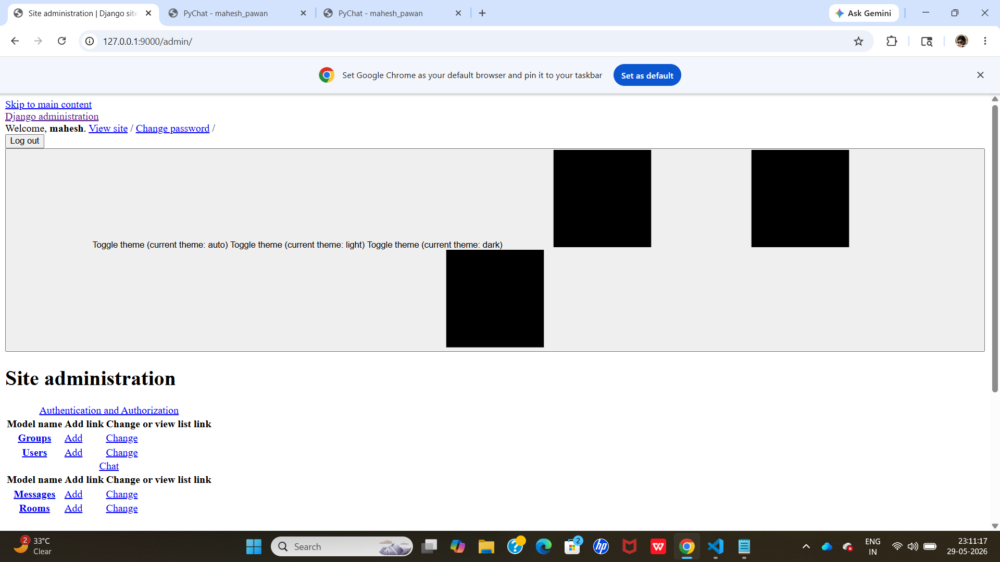
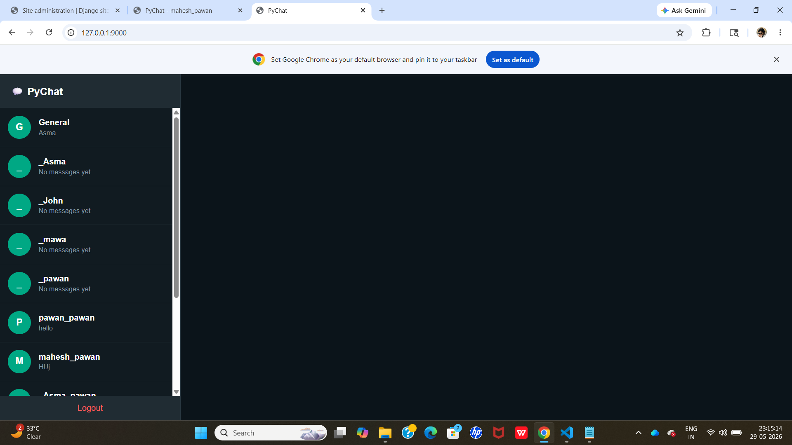
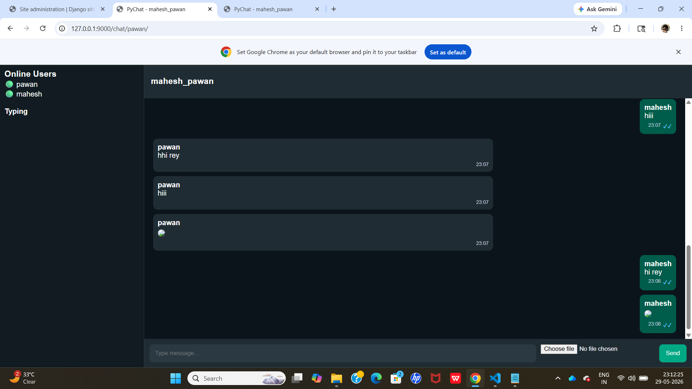
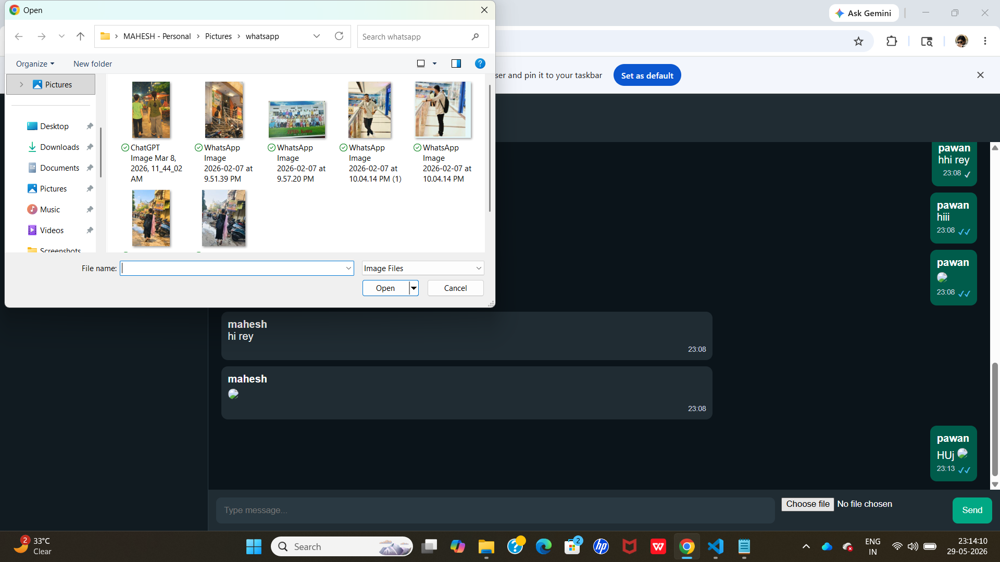

# PyChat - Real Time Django Chat App

A real-time chat application built using Django, Django Channels, WebSockets, HTML, CSS, and JavaScript.

---

## Features

* Real-time messaging
* Online users indicator
* Typing indicator
* Seen message ticks
* Image sharing
* Private chat rooms
* WhatsApp-style UI
* WebSocket communication using Django Channels

---

## Tech Stack

* Python
* Django
* Django Channels
* Daphne
* SQLite
* HTML
* CSS
* JavaScript

---

## Screenshots

### Login Page



### Main Chat Screen



### Chat Conversation



### Image Sharing



---

## Installation

### Clone Project

```bash id="l7vw3s"
git clone https://github.com/maheshvislavath18-star/realtime-chat-app.git
```

```bash id="6r2x5r"
cd realtime-chat-app
```

---

### Create Virtual Environment

```bash id="6w3g9v"
python -m venv venv
```

---

### Activate Virtual Environment

```bash id="g8u4u0"
venv\Scripts\activate
```

---

### Install Requirements

```bash id="rzyx1w"
pip install -r requirements.txt
```

---

### Run Migrations

```bash id="qbgwgo"
python manage.py migrate
```

---

### Run Django Server

```bash id="6k3yv2"
python manage.py runserver
```

---

### Run Daphne Server

```bash id="b6r7xy"
daphne -p 9000 core.asgi:application
```

---

## Open Browser

```text id="3f1op8"
http://127.0.0.1:9000/
```

---

## Author

ESLAVATH MAHESH

GitHub:
https://github.com/maheshvislavath18-star

